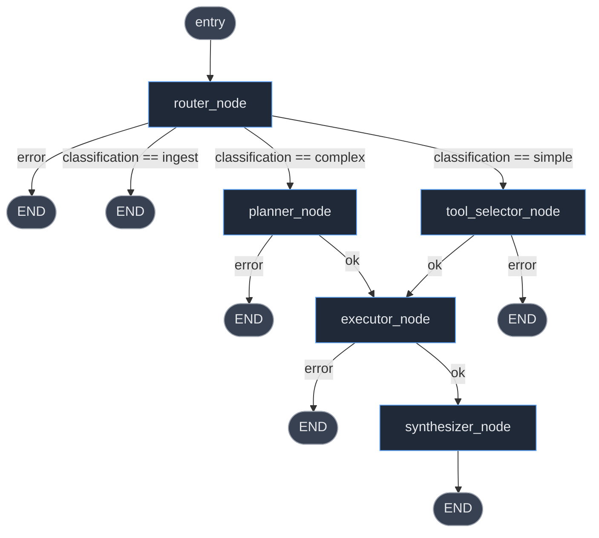
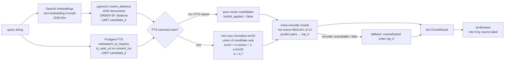

# FinCopilot — Agent & RAG Architecture

This document describes the runtime behaviour of the backend agent pipeline as it
is actually implemented in `backend/app/`. It traces a single chat request from
the HTTP boundary through the LangGraph agent, the RAG retrieval stack, and back
out over Server-Sent Events (SSE), and explains how an uploaded document becomes
queryable.

It is derived directly from the source. Key files referenced throughout:

| Concern | File |
| --- | --- |
| SSE endpoint + orchestration | `app/api/v1/chat.py` |
| Agent state contract | `app/agent/state.py` |
| Graph topology | `app/agent/graph.py` |
| Nodes | `app/agent/router.py`, `planner.py`, `tool_selector.py`, `executor.py`, `synthesizer.py` |
| SSE event bus | `app/agent/stream_context.py` |
| RAG retrieval | `app/services/retrieval.py` |
| Tools | `app/tools/*.py` |
| Document ingestion | `app/tasks/ingestion.py` |

> **Model configuration** (`app/config.py`): router / planner / tool-selector /
> summary / memory-extraction all default to `gpt-4o-mini`; the synthesizer
> defaults to `gpt-4o` (overridable per-request via the `model` form field).
> Embeddings use `text-embedding-3-small` (1536-dim). The cross-encoder reranker
> is `cross-encoder/ms-marco-MiniLM-L-6-v2`. Hybrid-search blend weight
> `HYBRID_SEARCH_ALPHA = 0.7`.

---

## 1. End-to-end request sequence (message → SSE close)

The endpoint is `POST /api/v1/chat/{conversation_id}/stream` (multipart form:
`message`, optional `model`, optional `files[]`). The handler does synchronous
validation/persistence first, then returns a `StreamingResponse` whose generator
(`_stream_events`) drives the agent and emits SSE frames.

The agent nodes never touch the HTTP layer directly. They push events into an
`asyncio.Queue` stored in a `ContextVar` (`stream_context.emit_event`); the
streaming generator drains that queue and serialises each event as an SSE frame.

```mermaid
sequenceDiagram
    autonumber
    actor U as Browser
    participant EP as stream_chat (chat.py)
    participant DB as Postgres
    participant Q as Celery (ingestion)
    participant GEN as _stream_events generator
    participant GR as compiled_graph (LangGraph)
    participant RT as router_node
    participant PL as planner_node
    participant TS as tool_selector_node
    participant EX as executor_node
    participant RS as RetrievalService
    participant TOOL as Tool(s)
    participant OAI as OpenAI
    participant SY as synthesizer_node

    U->>EP: POST /{conv}/stream (message, model, files?)
    EP->>EP: validate message not blank
    EP->>EP: regex-test CONFIRM:yes|no:<uuid> (HIL reply?)

    alt message is a CONFIRM reply
        EP->>DB: redis EXISTS confirm:<token>:pending
        EP-->>U: SSE confirmed → done  (no agent run)
    else normal message
        EP->>DB: SELECT conversation (owner + not deleted)
        EP->>DB: INSERT user Message; UPDATE conversation.updated_at
        EP->>DB: COUNT user messages (is_first?)
        EP->>DB: MemoryManager.load_memory (rolling_summary + last 3 msgs)
        EP->>DB: load_user_memories (UserMemory rows → analyst_profile)
        EP->>DB: SELECT ready Documents for conversation (limit 20)
        opt first user message
            EP->>OAI: generate_title (background task)
        end
        opt files attached
            loop each file
                EP->>EP: validate ext + size (≤100MB)
                EP->>DB: INSERT Document(status=pending)
                EP->>EP: write /app/uploads/<id>.<ext>
                EP->>Q: ingest_document.delay(...)
            end
        end
        EP-->>U: 200 StreamingResponse (text/event-stream)

        Note over GEN: Phase 1 — wait for ingestion (only if files)
        loop until all docs ready/failed or 300s timeout
            GEN-->>U: SSE ingest_progress {total,pending,ready,failed}
            GEN->>DB: SELECT Document status for pending ids
        end
        GEN-->>U: SSE ingest_complete (or error + return)

        Note over GEN: Phase 2 — run the agent graph
        GEN->>GEN: set_stream_queue(Queue) in ContextVar
        GEN->>GR: ainvoke(initial_state) as background task
        GR->>RT: router_node(state)
        RT-->>GEN: emit node_update(router_node, running)
        RT->>OAI: chat.completions (ROUTER_MODEL, max_tokens=10)
        OAI-->>RT: "simple" | "complex" | "ingest"

        alt classification == ingest
            GR-->>GR: route_after_router → END
        else classification == complex
            GR->>PL: planner_node(state)
            PL-->>GEN: emit node_update(planner_node, running)
            PL->>OAI: chat.completions (PLANNER_MODEL, json_object) → steps[]
            GR->>EX: executor_node(state)
        else classification == simple
            GR->>TS: tool_selector_node(state)
            TS-->>GEN: emit node_update(tool_selector_node, running)
            TS->>OAI: chat.completions (TOOL_SELECTOR_MODEL, json_object) → one tool or null
            GR->>EX: executor_node(state)
        end

        EX-->>GEN: emit node_update(executor_node, running)
        Note over EX: document_retrieval steps run first (sequential),<br/>other steps concurrently (Semaphore≤4)
        loop each plan step
            EX-->>GEN: emit tool_call(tool, step_id, running)
            EX->>TOOL: TOOL_REGISTRY[tool](validated_input)
            alt tool == document_retrieval
                TOOL->>RS: retrieve(query, top_k, doc_ids)
                RS->>OAI: embeddings.create (query vector)
                RS->>DB: pgvector cosine ORDER BY (candidate_k)
                RS->>DB: FTS websearch_to_tsquery / ts_rank_cd
                RS->>RS: hybrid merge (α·cosine + (1-α)·bm25)
                RS->>RS: cross-encoder rerank → top_k
                RS-->>TOOL: list[ChunkResult]
            else external tool
                TOOL->>OAI: (none) — yfinance / Serper / SEC / Tavily / DB
            end
            EX-->>GEN: emit tool_call(tool, step_id, complete|error)
        end
        opt document_finder returned ready/duplicate
            EX->>TOOL: follow-up document_retrieval (so new doc is queryable)
        end
        opt any chunks collected
            EX-->>GEN: emit sources {chunks}
        end

        GR->>SY: synthesizer_node(state)
        SY-->>GEN: emit node_update(synthesizer_node, running)
        alt no chunks + no tool data + document-specific query
            SY-->>GEN: emit token ("No documents uploaded yet…")
        else
            SY->>OAI: chat.completions (SYNTHESIZER_MODEL, stream=True)
            loop each delta
                SY-->>GEN: emit token {token}
            end
            opt tool-result path (not RAG, not LLM-only)
                SY->>OAI: chart extraction (json_object) → chart_data|null
            end
        end
        GR-->>GEN: graph done → queue.put(None) sentinel

        Note over GEN: Phase 3-6 — finalize
        GEN->>GEN: drain queue until None, yield each as SSE
        alt fatal error & no output
            GEN-->>U: SSE error; return
        else ingest classification
            GEN-->>U: SSE done (message_id=null); return
        else normal
            GEN->>GEN: relevance_score = mean(chunk scores) if rag_used
            GEN->>DB: INSERT assistant Message (rag_used, relevance, chunk_ids, chart_data)
            GEN->>Q: extract_memories.delay(user, conv)
            GEN->>OAI: (after 1s) LangSmith read_run → trace url
            GEN->>DB: UPDATE Message.agent_trace
            GEN->>DB: COUNT messages; if ≡0 mod 6 → regenerate rolling_summary
            opt chart_data present
                GEN-->>U: SSE chart_data {...}
            end
            GEN-->>U: SSE done {message_id, conversation_id}
        end
        GEN->>GEN: reset_stream_queue(token); cancel task if running
    end
```

### SSE event vocabulary

| Event | Emitted by | Payload |
| --- | --- | --- |
| `ingest_progress` | `_stream_events` Phase 1 | `{total, pending, ready, failed}` |
| `ingest_complete` | `_stream_events` Phase 1 | `{document_count}` |
| `node_update` | every node (first line) | `{node, status:"running"}` |
| `tool_call` | executor per step | `{tool_name, step_id, status:"running"\|"complete"\|"error"}` |
| `sources` | executor (if chunks) | `{chunks:[ChunkDict]}` |
| `confirmation_required` | `document_finder` (HIL) | `{token, ticker, filing_type, period, description}` |
| `confirmed` | `_handle_confirmation` | `{token, answer}` |
| `token` | synthesizer (streamed) | `{token}` |
| `chart_data` | `_stream_events` Phase 6 | the chart payload |
| `error` | various | `{message}` / `{code, message, ...}` |
| `done` | `_stream_events` | `{message_id, conversation_id}` |

---

## 2. LangGraph node topology

The graph is built in `app/agent/graph.py` and compiled once at import time
(`compiled_graph`). Entry point is `router_node`. Every conditional edge first
checks `state["error"]` — any node that writes `error` short-circuits to `END`,
where `chat.py` decides whether to surface it.



Routing functions (all in `graph.py`):

- `route_after_router` → `END` (error or `ingest`), `planner_node` (complex),
  else `tool_selector_node` (simple — the default fallback).
- `route_after_planner` / `route_after_tool_selector` → `executor_node` (or `END` on error).
- `route_after_executor` → `synthesizer_node` (or `END` on error).
- `synthesizer_node` → unconditional `END`.

Note the **two mutually exclusive plan-producers**: `planner_node` (multi-step,
complex) and `tool_selector_node` (single tool or none, simple). Both write the
same `state["plan"]` shape consumed by `executor_node`.

---

## 3. Agent nodes — reads, writes, decisions

All node functions are `async def node(state: AgentState) -> dict` and return a
**partial** state update that LangGraph merges. Every node calls
`emit_event({"type":"node_update", ...})` as its first action. State is strictly
JSON-serializable (see the serialization contract at the top of `state.py` —
UUIDs are stringified, datetimes ISO-formatted before entering state).

### `router_node` (`router.py`)
- **Reads:** `query`, `has_uploaded_documents`, `conversation_summary`,
  `recent_messages`.
- **Builds context:** prefixes `[has_documents: true]`, the rolling summary, and
  the last few messages onto the query before classifying.
- **Calls:** OpenAI `ROUTER_MODEL`, `max_tokens=10`, `temperature=0`.
- **Decision:** classifies into `simple` / `complex` / `ingest`. Unknown output
  falls back to `complex`. Documents already ingested are never `ingest`.
- **Writes:** `classification` (or `error`).

### `planner_node` (`planner.py`) — complex path
- **Reads:** `classification`, `query`, `has_uploaded_documents`,
  `available_documents`.
- **Guard:** returns `{"plan": []}` immediately if classification isn't `complex`.
- **Builds context:** injects `[has_documents: true]` and a compact JSON
  `[available_documents: ...]` block so the model can target specific doc UUIDs.
- **Calls:** OpenAI `PLANNER_MODEL`, `response_format=json_object`, `temperature=0`.
- **Decision:** decomposes the query into an ordered list of up to 6 independent
  tool calls. `_extract_raw_steps` tolerates several JSON shapes (`{"steps":[...]}`,
  a bare list, a single step dict, or any other wrapped list). Steps whose
  `tool_name` is not in `TOOL_REGISTRY` are dropped; the list is truncated to 6.
- **Writes:** `plan` (list of `{tool_name, input}`) — or `error`.

### `tool_selector_node` (`tool_selector.py`) — simple path
- **Reads:** `classification`, `query`, `has_uploaded_documents`,
  `available_documents`, `user_id`, `conversation_id`.
- **Guard:** returns `{"plan": []}` if classification isn't `simple`.
- **Calls:** OpenAI `TOOL_SELECTOR_MODEL`, `response_format=json_object`,
  `temperature=0`, `max_tokens=300`.
- **Decision:** picks exactly one tool or `null` (null → empty plan → synthesizer
  answers from LLM knowledge). Injects `user_id` / `conversation_id` for
  `document_retrieval`, `document_finder`, `portfolio_analysis`. Validates the
  input against the tool's Pydantic schema; on `ValidationError` returns an empty
  plan rather than erroring.
- **Writes:** `plan` of length 0 or 1 (validated, `model_dump(mode="json")`).

### `executor_node` (`executor.py`)
- **Reads:** `plan`, `user_id`, `conversation_id`, `available_documents`, `query`.
- **Empty-plan path:** returns empty results with `rag_used=False`.
- **Ordering strategy:**
  1. **`document_retrieval` steps run first, sequentially**, so RAG context is
     authoritative before the synthesizer and chunk counts are stable.
  2. **All other steps run concurrently** under `asyncio.Semaphore(4)` via
     `asyncio.gather`.
- **Per-step (`_run_step`):** re-injects auth IDs, truncates retrieval queries to
  500 chars, validates and drops `doc_ids` not present in `available_documents`,
  validates input against the tool schema, invokes the tool, and wraps the result
  in a success/error envelope (`{tool_name, status, data|error}`). Never raises —
  a failed step yields an error envelope so siblings still run. Emits
  `tool_call` running/complete/error events around each invocation.
- **`document_finder` follow-up:** if a finder step returns `ready`/`duplicate`,
  the executor immediately runs a `document_retrieval` against the just-ingested
  doc so it's queryable in the same turn (`step_N_retrieval` key).
- **Chunk handling:** `_normalize_chunks` unwraps `DocumentRetrievalOutput` into
  `ChunkDict`s (carrying `chunk_id`, `document_id`, filename, type, score);
  `_dedup_chunks` removes duplicates by content. Emits a `sources` event when any
  chunks exist.
- **Writes:** `tool_results`, `retrieved_chunks`, `reranked_chunks`, `rag_used`.

  > **Note on reranking:** the executor sets `reranked_chunks = all_chunks` with a
  > `# TODO: replace with real reranker`. The *actual* cross-encoder reranking
  > already happened **inside `RetrievalService.retrieve`** (§4). So
  > `reranked_chunks` here is a passthrough of chunks the retrieval service already
  > ranked — not a second rerank.

### `synthesizer_node` (`synthesizer.py`)
- **Reads:** `tool_results`, `reranked_chunks`, `query`, `conversation_summary`,
  `recent_messages`, `analyst_profile`, `model`.
- **Splits** tool results into `successful` / `failed` envelopes.
- **No-docs guard:** if there are no chunks, no successful tools, and the query is
  document-specific (`_is_document_specific` keyword match), it emits a single
  "No documents uploaded yet" token and stops — no LLM call.
- **System-prompt selection (priority order):**
  1. `reranked_chunks` present → **RAG prompt** (answer only from chunks, cite
     `[N]` by source label).
  2. else successful tool data → **tools prompt** (compute arithmetic from the
     numbers, acknowledge failed tools).
  3. else → **LLM-only prompt** (general knowledge, no fabricated figures).
- **Builds user message** from: rolling summary, last 3 messages, analyst profile,
  the query, a truncated (`≤500` char) tool-results section, and up to 10
  source-labelled chunks.
- **Calls:** OpenAI `model` (request override or `SYNTHESIZER_MODEL`),
  `stream=True`, `temperature=0.2`; emits each delta as a `token` event and
  accumulates `final_output`.
- **Chart extraction:** only on the tool-result path (never RAG / LLM-only).
  A second OpenAI call (`_extract_chart_data`, `json_object`) decides if the tool
  data is chartable (`line`/`bar`/`pie`) and returns a series spec, else `null`.
- **Writes:** `final_output`, `chart_data` (or `error` + `chart_data=None`).

### Post-graph finalization (`chat.py` `_stream_events`, Phases 3–6)
Not a graph node, but where durable state is written:
- Computes `relevance_score` = mean cosine similarity of retrieved chunks (only
  when `rag_used`), and collects `retrieved_chunk_ids` for provenance.
- Persists the assistant `Message` (with `rag_used`, `relevance_score`,
  `retrieved_chunk_ids`, `chart_data`) and bumps `conversation.updated_at`.
- Fires `extract_memories.delay(...)` (cross-session memory, non-blocking).
- Best-effort LangSmith trace URL → `Message.agent_trace`.
- Every 6th message, regenerates the conversation `rolling_summary`
  (`MemoryManager.regenerate_summary`, `SUMMARY_MODEL`).
- Emits `chart_data` (if any) then `done`.

---

## 4. RAG pipeline — embedding → pgvector → BM25 → hybrid → rerank → synthesis

Implemented in `RetrievalService.retrieve` (`app/services/retrieval.py`), invoked
by the `document_retrieval` tool. All retrieval is scoped to a single
`(user_id, conversation_id)` and optionally filtered to specific `doc_ids`.



Step by step:

1. **Embed the query.** A fresh `openai.AsyncOpenAI` client embeds the query with
   `text-embedding-3-small` → a 1536-dim vector.

2. **Candidate breadth.** When the cross-encoder is loaded, `candidate_k =
   top_k × 3` (`_RERANK_CANDIDATE_MULTIPLIER`) so the reranker has headroom;
   otherwise `candidate_k = top_k`.

3. **Vector search.** `DocumentChunk.embedding.cosine_distance(query_vec)` ordered
   ascending, joined to `Document` for attribution metadata, filtered by user +
   conversation + non-null embedding (+ optional `doc_ids`), limited to
   `candidate_k`. Similarity is stored as `1.0 − distance`. If no rows → return
   `[]` (the no-docs path).

4. **Full-text (BM25-style) search.** `_fts_query` runs
   `websearch_to_tsquery('english', query)` against the persisted `content_tsv`
   generated column and ranks with `ts_rank_cd`. Wrapped in try/except — any
   failure (or empty result) falls back to pure vector.

5. **Hybrid merge.** When FTS has rows: FTS scores are min-max normalized to
   `[0,1]` (all-equal → all `1.0`), then the **union** of vector and FTS candidate
   chunk-ids is scored as `hybrid = α·cosine + (1−α)·bm25_norm` with
   `α = HYBRID_SEARCH_ALPHA = 0.7`. Merged candidates are sorted by hybrid score
   and cut to `candidate_k`. (`hybrid_search_applied=True` is logged.)

6. **Cross-encoder rerank** (`_rerank`). If the encoder is loaded and there are
   candidates, `_rerank_sync` scores `(query, chunk.content)` pairs with
   `ms-marco-MiniLM-L-6-v2` (run in a thread via `asyncio.to_thread`), sorts
   descending, and returns the top_k. If the encoder is unavailable or raises, it
   falls back to the existing cosine/hybrid order truncated to `top_k`.

7. **Filter pass (tool-level).** The `document_retrieval` tool optionally
   over-fetches (`top_k × 4`) when `ticker` / `doc_type` / `fiscal_year` filters
   are set, applies them in Python, then trims to `top_k`.

8. **Synthesis.** The executor normalizes `ChunkResult`s into `ChunkDict`s; the
   synthesizer formats up to 10 as `[N] [Source: filename] content` and instructs
   the model to cite inline `[N]` and answer **only** from the chunks.

---

## 5. Document data flow — upload → ingestion → retrieval → synthesis

Two ingestion entry points feed the same Celery task and the same chunk table:

- **User upload** (`chat.py` `_ingest_files`): validates extension
  (`pdf/docx/csv/txt/html`) and size (≤100 MB), inserts a `pending` `Document`,
  writes the bytes to `/app/uploads/<id>.<ext>`, and enqueues
  `ingest_document.delay(...)`. The SSE generator then **polls** the DB (Phase 1)
  until every doc is `ready`/`failed` or the 300 s timeout fires.
- **Agent-fetched** (`document_finder` tool): resolves a filing from SEC EDGAR
  (10-K/10-Q) or the web via Tavily, asks the user to confirm (HIL over Redis),
  downloads it, inserts a `Document`, enqueues the same task, then **subscribes to
  a Redis pub/sub channel** (`document.<id>.status`) and waits up to 600 s.

```mermaid
flowchart TD
    subgraph Upload paths
      A1[User uploads files<br/>chat.py _ingest_files] -->|validate ext+size| D1[(INSERT Document<br/>status=pending)]
      A1 -->|write bytes| FS[/app/uploads/&lt;id&gt;.ext/]
      A2[Agent: document_finder] -->|SEC EDGAR / Tavily + HIL confirm| FS
      A2 --> D1
    end

    D1 --> ENQ[[ingest_document.delay<br/>Celery + Redis broker]]
    FS --> ENQ

    subgraph Celery worker — ingestion.py
      ENQ --> P1[status=processing<br/>publish redis status]
      P1 --> P2[_extract_pages<br/>pdf/docx/csv/txt/html<br/>→ list page_num,text]
      P2 --> G{full_text ≥ 50 chars?}
      G -->|no| FAIL[status=failed<br/>no extractable text]
      G -->|yes| P3[_build_chunks<br/>tiktoken cl100k_base<br/>800 tokens / 100 overlap<br/>+ page_numbers]
      P3 --> P4[OpenAI embeddings<br/>text-embedding-3-small<br/>batches of 200<br/>retry×3 on API/RateLimit]
      P4 --> P5[(bulk INSERT DocumentChunk<br/>embedding Vector1536<br/>content_tsv computed)]
      P5 --> P6[Document.chunk_count<br/>status=ready<br/>publish redis status]
    end

    P6 --> WAIT{caller waits}
    WAIT -->|upload path| POLL[chat.py polls DB<br/>SSE ingest_progress]
    WAIT -->|finder path| SUB[document_finder<br/>redis pub/sub listen]

    POLL --> RET
    SUB --> RET[document_retrieval tool<br/>→ RetrievalService.retrieve]
    RET --> RAG[[embed → pgvector → FTS → hybrid → rerank]]
    RAG --> SYN[synthesizer_node<br/>cite N from chunks]
    SYN --> MSG[(assistant Message<br/>rag_used, relevance_score,<br/>retrieved_chunk_ids)]
```

Ingestion task detail (`app/tasks/ingestion.py`, sync SQLAlchemy + sync OpenAI):

1. **Status → processing**, publish to `document.<id>.status`.
2. **Parse** format-specifically into `(page_num, text)` tuples. DOCX preserves
   heading levels as Markdown and flattens tables/textboxes; CSV groups 10 rows
   per "page"; PDF is one tuple per page; TXT/HTML collapse to a single page.
3. **Guard:** if `< 50` extractable chars → `failed` ("no extractable text").
4. **Chunk** with `tiktoken` `cl100k_base`: 800-token sliding window, 100-token
   overlap. A token→char offset map assigns the source `page_numbers` to each
   chunk.
5. **Embed** chunk contents in batches of 200 (`text-embedding-3-small`), sleeping
   1 s between batches. On `APIError`/`RateLimitError`, retries up to 3× with
   exponential backoff (`30·2^retries` s); on final failure marks `failed`.
6. **Bulk insert** `DocumentChunk` rows (1536-dim `embedding`, `chunk_metadata`
   JSONB with page numbers/filename/file type). `content_tsv` is a Postgres
   `Computed` column (`to_tsvector('english', content)`, persisted) — the FTS
   index is maintained by the database, not the task.
7. **Status → ready** with `chunk_count`, publish to Redis. The temp file is
   removed only when not retrying.

Once `ready`, chunks are visible to `RetrievalService.retrieve` (§4) for any
message in that conversation, and the synthesizer cites them in its answer.

---

## Appendix — `AgentState` fields (from `state.py`)

| Field | Written by | Notes |
| --- | --- | --- |
| `user_id`, `conversation_id` | `chat.py` init | stringified UUIDs |
| `query`, `model` | `chat.py` init | raw user message; synth model override |
| `analyst_profile` | `chat.py` (`load_user_memories`) | cross-session memory bullets |
| `conversation_summary`, `recent_messages` | `chat.py` (`load_memory`) | rolling summary + last 3 |
| `has_uploaded_documents`, `available_documents` | `chat.py` init | ready docs for the conversation |
| `classification` | `router_node` | `simple`/`complex`/`ingest` |
| `plan` | `planner_node` *or* `tool_selector_node` | list of `{tool_name, input}` |
| `tool_results` | `executor_node` | `step_N` → ok/error envelope |
| `retrieved_chunks`, `reranked_chunks`, `rag_used` | `executor_node` | normalized `ChunkDict`s |
| `final_output`, `chart_data` | `synthesizer_node` | streamed answer + optional chart |
| `relevance_score` | `chat.py` post-graph | mean cosine of chunks |
| `error` | any node | non-null → conditional edge routes to `END` |
| `retrieval_quality_score`, `retry_count` | `chat.py` init | initialized but not currently mutated by the live graph |
| `portfolio_data` | `chat.py` init (`None`) | reserved; portfolio data currently flows via `tool_results` |
